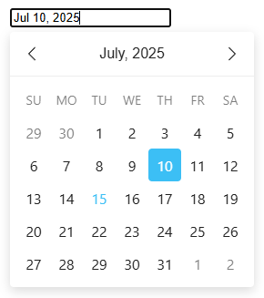

# TS Datepicker
[](https://www.npmjs.com/package/@smartexcan/ts-datepicker)

A lightweight and dependency-free datepicker written in Typescript.



## Install
```bash
npm install @smartexcan/ts-datepicker
```

## Usage
TS Datepicker ships in both ESM and UMD format.

```js
import DatePicker from "@smartexcan/ts-datepicker";

new DatePicker(elementOrSelector [, options]);
```

Available files:
- UMD: dist/datepicker[.min].js
- ESM: dist/datepicker.esm[.min].js
- styles: dist/datepicker[.min].css
- types: dist/types/index.d.ts
- locales (see below)

Source maps are also created for all js files.

## Options

Please see [options.ts](./src/types/options.ts) for full list of options.

## Localization
TS Datepicker comes with english as the default locale.

You can supply a custom locale, or import them from `dist/locales`.

(Please see `dist/locales` for available locales. Locales are only supplied as ES modules.)

```js
import DatePicker from "@smartexcan/ts-datepicker";
import frCH from "@smartexcan/ts-datepicker/locales/fr-CH";

// add to global locale cache
DatePicker.locales['fr-CH'] = frCH;
new DatePicker(element, { locale: 'fr-CH' });

// use imported/custom locale directly
new DatePicker(element, { locale: frCH });

// custom locale
const locale = {
    days: ["Sunday", "Monday", "Tuesday", "Wednesday", "Thursday", "Friday", "Saturday"],
    daysShort: ["Sun", "Mon", "Tue", "Wed", "Thu", "Fri", "Sat"],
    daysMin: ["Su", "Mo", "Tu", "We", "Th", "Fr", "Sa"],
    months: ["January", "February", "March", "April", "May", "June", "July", "August", "September", "October", "November", "December"],
    monthsShort: ["Jan", "Feb", "Mar", "Apr", "May", "Jun", "Jul", "Aug", "Sep", "Oct", "Nov", "Dec"],
    today: "Today",
    clear: "Clear",
    format: "yyyy-mm-dd",
    weekStart: 0,
    rtl: false
};

DatePicker.locales.custom = locale;
new DatePicker(element, { locale: 'custom' });
```

All fields in custom locale are optional and fallback to default locale.

## Credits
TS Datepicker is inspired by and combines the features I liked the most from the following projects:

- [Vanilla JS Datepicker](https://github.com/mymth/vanillajs-datepicker)
- [Air Datepicker](https://github.com/t1m0n/air-datepicker)
- [flatpickr](https://github.com/flatpickr/flatpickr)

## License
TS Datepicker is MIT licensed
